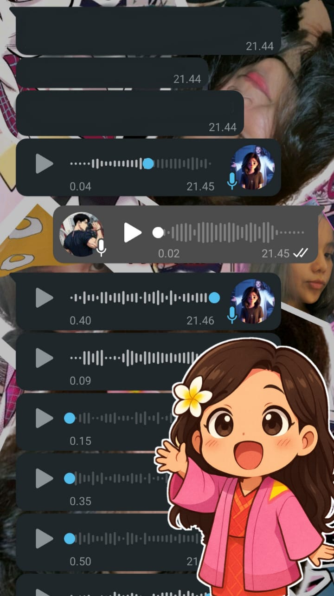
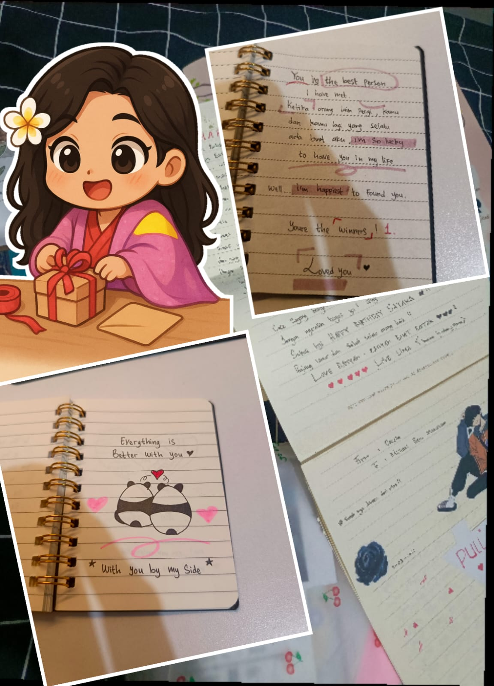

<html lang="en">
<head>
    <meta charset="UTF-8">
    <meta name="viewport" content="width=device-width, initial-scale=1.0">
    <title>Happy 20th Birthday, My Love - Natural Image Fit</title>
    
    
</head>
<body class="relative">
    <!-- Floating hearts background -->
    

    
    <!-- Navigation -->
    <nav class="bg-white bg-opacity-90 backdrop-filter backdrop-blur-lg w-full shadow-md">
        

            

                
Happy 20th Brigitta Cecelia (Bakpao)

                

                    <a href="#home" class="nav-link">Home</a>
                    <a href="#memories" class="nav-link">Unconditional love</a>
                    <a href="#wishes" class="nav-link">My Wishes</a>
                

                <button class="md:hidden focus:outline-none">
                    <svg class="w-6 h-6" fill="none" stroke="currentColor" viewBox="0 0 24 24" xmlns="http://www.w3.org/2000/svg">
                        <path stroke-linecap="round" stroke-linejoin="round" stroke-width="2" d="M4 6h16M4 12h16M4 18h16"></path>
                    </svg>
                </button>
            

        

    </nav>
    
    <!-- Home Section -->
    <section id="home" class="min-h-screen flex items-center justify-center px-4" style="background: linear-gradient(135deg, var(--primary-pink) 0%, var(--accent-lavender) 100%);">
        

            

                <h1 class="hero-title text-5xl md:text-6xl mb-6" style="color: var(--text-dark);">Happy 20th Birthday!</h1>
                
To the most amazing person in my life, may your special day be as wonderful as you are.

                <button class="btn-primary text-white px-8 py-3 rounded-full font-semibold">Discover More</button>
            

            

                
                

                    

                        20
                    

                

            

        

    </section>
    
    <!-- Memories Section -->
    <section id="memories" class="py-20 px-4 memories-section">
        

            <h2 class="section-title text-3xl md:text-4xl font-bold text-center mb-16" style="color: white;">The Most Thing I Loved</h2>
            
            

                <!-- Memory 1 -->
                

                    

                        
                    

                    

                        <h3>When U Heal Me</h3>
                        
Selalu jadi tempat pulang buat aku dan yang terbaik

                        

                            
                        

                    

                

                
                <!-- Memory 2 -->
                

                    

                        
                    

                    

                        <h3>Ambitious Soul</h3>
                        
Aku suka banget lihat kamu serius belajar. Ambisimu bikin aku kagum, dan tiap nilai bagus yang kamu dapat itu bukti kalau kerja kerasmu nggak sia-sia. Semangat terus ya sayang.

                        

                            
                        

                    

                

                
                <!-- Memory 3 -->
                

                    

                        
                    

                    

                        <h3>Queen Yapping</h3>
                        
Aku selalu ketawa sendiri kalau kamu mulai yapping. Kadang ceritanya ngawur absurd dan kadang punya pemikiran out of the box, tapi justru itu yang bikin aku betah dengerin kamu terus. Aku suka caramu cerita, karena dari situ aku bisa lihat betapa hidupnya kamu. Jangan pernah berhenti yapping ya, soalnya itu bagian favoritku dari kamu.

                        

                            
                        

                    

                

                
                
                <!-- Memory 5 -->
                

                    

                        
                    

                    

                        <h3>"Belum Ngantuk Seng"</h3>
                        
Ngeliat kamu ngantuk tuh lucu banget, apalagi pas lagi asik ngobrol tiba-tiba diam… eh ternyata udah ketiduran.padahal 5 menit yang lalu blg "blom ngantuk seng

                        

                            
                        

                    

                

                <!-- Memory 4 -->
                

                    

                        
                    

                    

                        <h3>Efforts And Creative</h3>
                        
Aku sadar kalau nggak semua orang bisa se-niat kamu. Kreativitas dan usaha kamu itu bikin aku ngerasa istimewa, dan aku nggak akan pernah anggap itu hal kecil

                        

                            
                        

                    

                

                
                <!-- Memory 6 -->
                

                    

                        
                    

                    

                        <h3>Above all, because you're the one.</h3>
                        
No matter what happens, no matter how complicated things get, at the end of it all, the reason I choose, the reason I stay, is because you're the one.

                        

                            
                        

                    

                

            

        

    </section>
    
    <!-- Wishes Section -->
    <section id="wishes" class="py-20 px-4" style="background: linear-gradient(135deg, var(--accent-lavender) 0%, var(--accent-champagne) 100%);">
        

            <h2 class="section-title text-3xl md:text-4xl font-bold text-center mb-16" style="color: var(--text-dark);">My Heartfelt Wishes for You</h2>
            
            

                <!-- Wish 1 -->
                

                    

                        

                            💖
                        

                        <h3 class="text-xl font-semibold">Happiness</h3>
                    

                    
Aku cuma ingin kamu terus punya alasan untuk tersenyum, sekecil apa pun itu.
Kamu pantas untuk bahagia, bahkan di hari-hari biasa.
Kalau kamu butuh tempat untuk istirahat sejenak dari dunia, aku selalu ada.
Semoga aku bisa tetap jadi bagian dari ketenangan dan senyummu.

                

                
                <!-- Wish 2 -->
                

                    

                        

                            🌟
                        

                        <h3 class="text-xl font-semibold">Success</h3>
                    

                    
Aku tahu kamu kerja keras dan nggak selalu cerita semuanya.
Tapi aku lihat usahamu, dan aku bangga.
Nggak apa-apa jalanmu pelan, yang penting tetap maju.
Aku akan tetap di sini, ngedukung kamu dengan cara paling sederhana yang aku bisa.

                

                
                <!-- Wish 3 -->
                

                    

                        

                            🌷
                        

                        <h3 class="text-xl font-semibold">Love</h3>
                    

                    
Mungkin caramu nunjukin cinta agak unik kadang gengsimu setinggi langit,
marahnya keliatan cuek, tapi aku tahu di balik itu kamu actually care banget.
Setiap kali kita ribut, kamu kesel sendiri, mikir sendiri, dan akhirnya… ya, mellow sendiri.
Lucu sih, tapi justru dari situ aku tahu your love is real, your love is purely genuine semoga,kamu selalu begini dan akan tetap begini, love u 

                

                
                <!-- Wish 4 -->
                

                    

                        

                            🌎
                        

                        <h3 class="text-xl font-semibold">Adventure</h3>
                    

                    
Kamu hebat, Seng… atau lebih tepatnya, my partner in life aku tahu caramu bertahan selama ini, dan itu bukan hal yang mudah, bahkan cukup menegangkan.
Dari luar kamu tampak bercahaya, berapi-api, tapi bersamaku semuanya terbalik dan terasa lebih tenang dan jujur, aku suka sisi itu.
Aku suka caramu berkembang, berpikir, mencari solusi, dan aku percaya kamu punya potensi besar untuk mencapai tempat yang selama ini kamu tuju.
I'm totally proud of you keep going, karena apa pun yang terjadi, aku akan selalu ada di sampingmu.

                

            

            
            

                

                    <h3 class="text-2xl font-semibold mb-6" style="color: var(--text-dark);">A Special Message Just For You</h3>
                    

                        

                            💌
                        

                        

                            "Happy birthday, Bakpao I know this year has been really heavy for you, with so many things testing your heart and mind. But I want you to always remember you're never alone in any of it. I'm here, always, to listen, to stay by your side, and to be the place you can come home to when everything feels overwhelming.

On your birthday, I hope you feel how deeply loved and cherished you are. No matter how tough things get, you're safe with me. I'll hold your hand through it all, and we'll face whatever comes together. May this new year of your life bring you more peace, warmth, and the happiness you truly deserve.

别难过啦，二十岁才刚刚开始，你还有好多冒险要去经历。想想看，以后的你会笑着说：'哇，原来二十岁那年我那么坚强！"
                        

                    

                

            

        

    </section>
    
    <!-- Countdown Section -->
    <section id="countdown" class="py-20 px-4 countdown-section">
        

            <h2 class="section-title text-3xl md:text-4xl font-bold mb-6" style="color: white;">Birthday Countdown</h2>
            
Until we celebrate together!

            
            

                

                    
00

                    
Days

                

                

                    
00

                    
Hours

                

                

                    
00

                    
Minutes

                

                

                    
00

                    
Seconds

                

            

            
            

                <h3 class="text-2xl font-semibold mb-4" style="color: var(--text-dark);">Get Ready, Our Journey is still to long!</h3>
                
Before we start let me know what would make your birthday extra special.

                
                <form id="birthdayForm" class="space-y-4 text-left">
                    

                    
                    

                        <label class="block text-gray-700 mb-2">Special Birthday Wish</label>
                        <textarea id="birthdayWish" class="w-full px-4 py-2 rounded-lg border border-pink-200 focus:outline-none focus:ring-2 focus:ring-pink-300" rows="3" placeholder="What would make your day perfect?"></textarea>
                
                    <button type="submit" class="btn-primary text-white px-8 py-3 rounded-full font-semibold">Send</button>

        

    <!-- Footer -->
    <footer class="py-12 px-4" style="background-color: var(--text-dark); color: white;">
        

            

                

                    <h3 class="text-2xl font-bold mb-2">Happy 20th Birthday</h3>
                    
For the most special person in my life

                

                
                

                    <a href="#" class="hover:text-pink-200 transition duration-300">
                        <svg class="w-6 h-6" fill="currentColor" viewBox="0 0 24 24" xmlns="http://www.w3.org/2000/svg">
                            <path d="M12 2.163c3.204 0 3.584.012 4.85.07 3.252.148 4.771 1.691 4.919 4.919.058 1.265.069 1.645.069 4.849 0 3.205-.012 3.584-.069 4.849-.149 3.225-1.664 4.771-4.919 4.919-1.266.058-1.644.07-4.85.07-3.204 0-3.584-.012-4.849-.07-3.26-.149-4.771-1.699-4.919-4.92-.058-1.265-.07-1.644-.07-4.849 0-3.204.013-3.583.07-4.849.149-3.227 1.664-4.771 4.919-4.919 1.266-.057 1.645-.069 4.849-.069zm0-2.163c-3.259 0-3.667.014-4.947.072-4.358.2-6.78 2.618-6.98 6.98-.059 1.281-.073 1.689-.073 4.948 0 3.259.014 3.668.072 4.948.2 4.358 2.618 6.78 6.98 6.98 1.281.058 1.689.072 4.948.072 3.259 0 3.668-.014 4.948-.072 4.354-.2 6.782-2.618 6.979-6.98.059-1.28.073-1.689.073-4.948 0-3.259-.014-3.667-.072-4.947-.196-4.354-2.617-6.78-6.979-6.98-1.281-.059-1.69-.073-4.949-.073zm0 5.838c-3.403 0-6.162 2.759-6.162 6.162s2.759 6.163 6.162 6.163 6.162-2.759 6.162-6.163c0-3.403-2.759-6.162-6.162-6.162zm0 10.162c-2.209 0-4-1.79-4-4 0-2.209 1.791-4 4-4s4 1.791 4 4c0 2.21-1.791 4-4 4zm6.406-11.845c-.796 0-1.441.645-1.441 1.44s.645 1.44 1.441 1.44c.795 0 1.439-.645 1.439-1.44s-.644-1.44-1.439-1.44z"/>
                        </svg>
                    </a>
                    <a href="#" class="hover:text-pink-200 transition duration-300">
                        <svg class="w-6 h-6" fill="currentColor" viewBox="0 0 24 24" xmlns="http://www.w3.org/2000/svg">
                            <path d="M22.675 0h-21.35c-.732 0-1.325.593-1.325 1.325v21.351c0 .731.593 1.324 1.325 1.324h11.495v-9.294h-3.128v-3.622h3.128v-2.671c0-3.1 1.893-4.788 4.659-4.788 1.325 0 2.463.099 2.795.143v3.24l-1.918.001c-1.504 0-1.795.715-1.795 1.763v2.313h3.587l-.467 3.622h-3.12v9.293h6.116c.73 0 1.323-.593 1.323-1.325v-21.35c0-.732-.593-1.325-1.325-1.325z"/>
                        </svg>
                    </a>
                    <a href="#" class="hover:text-pink-200 transition duration-300">
                        <svg class="w-6 h-6" fill="currentColor" viewBox="0 0 24 24" xmlns="http://www.w3.org/2000/svg">
                            <path d="M23.953 4.57a10 10 0 01-2.825.775 4.958 4.958 0 002.163-2.723c-.951.555-2.005.959-3.127 1.184a4.92 4.92 0 00-8.384 4.482C7.69 8.095 4.067 6.13 1.64 3.162a4.822 4.822 0 00-.666 2.475c0 1.71.87 3.213 2.188 4.096a4.904 4.904 0 01-2.228-.616v.06a4.923 4.923 0 003.946 4
